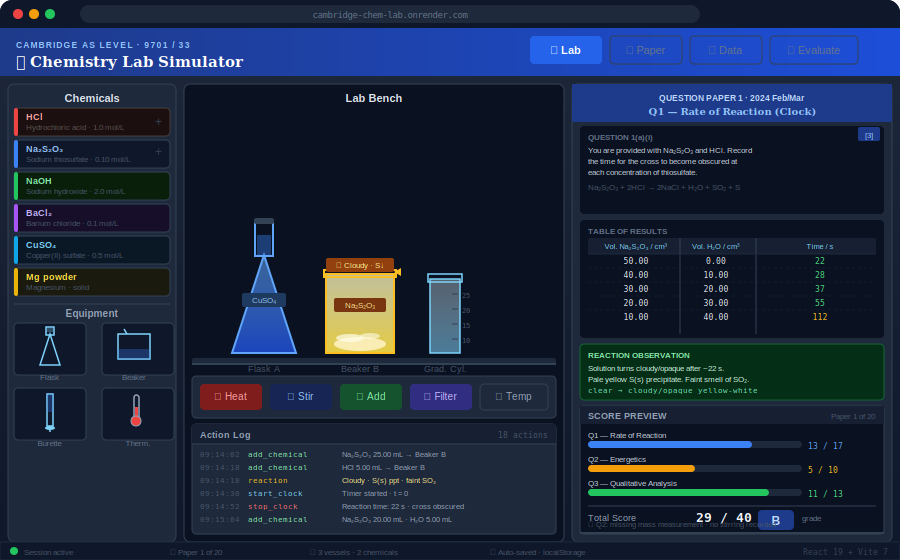

# Cambridge Chemistry Lab Simulator

[](https://github.com/nsriram/chem_lab/actions/workflows/ci.yml)
[](LICENSE)

> A free, browser-based virtual chemistry laboratory for Cambridge AS Level Chemistry (9701 Paper 3).
> Practice real past-paper experiments at home — no equipment needed.

**[Try it live →](https://cambridge-chem-lab.onrender.com/)**



---

## What is this?

Cambridge Paper 3 (Advanced Practical Skills) tests students on titrations, enthalpy experiments, and qualitative analysis — all done in a real school lab. This simulator brings those experiments to any device so students can practise the full workflow: set up apparatus, mix chemicals, record observations, write answers, and get instant mark-scheme feedback.

---

## Features

- **23 real past papers** — Feb/Mar sessions from 2021 to 2025, covering every question type students will encounter.
- **Full virtual bench** — choose glassware, add reagents, heat, stir, filter, and weigh, with realistic colour changes and gas observations.
- **Live reaction feedback** — the lab responds to what you do: indicators change colour at the endpoint, precipitates form, gases are identified.
- **Measurement precision hints** — get nudged when a burette reading isn't to 0.05 cm³ or a balance reading isn't to 0.01 g.
- **Per-question answer boxes** — type written answers alongside each question part, mirroring the Cambridge answer booklet layout. Add results tables and scatter graphs directly within each answer box.
- **Free Lab mode** — experiment without a set paper; great for exploring reactions and building intuition.
- **Automated marking** — a built-in rubric engine scores every section against the Cambridge mark scheme and gives criterion-by-criterion feedback.
- **PDF report export** — download a formatted report of your session including observations, answers, and scores.
- **Multilingual UI** — switch between English, Tamil, Hindi, Spanish, and Chinese.
- **Works offline** — your session is saved automatically; nothing is lost on refresh.

---

## How to use it

1. **Pick a paper** — choose any past paper from the Paper selector at the top.
2. **Read the question** — the Paper tab shows the full question context and each part.
3. **Do the experiment** — switch to the Lab tab, set up your bench, and carry out the practical.
4. **Write your answers** — type answers into each question part box in the Paper tab. Use the inline table and graph tools to record results alongside each question.
5. **Submit for marking** — go to the Evaluate tab and click *Submit for Evaluation* to see your score.

---

## Running locally

You need [Node.js 20+](https://nodejs.org/).

```bash
git clone https://github.com/nsriram/chem_lab.git
cd chem_lab
npm install
npm run dev        # opens at http://localhost:5173
```

---

## Covered topics

| Paper type | Topics |
|---|---|
| Quantitative | Rate of reaction (clock), acid-base titration, iodometric titration, back-titration, water of crystallisation |
| Energetics | Enthalpy of displacement, enthalpy of neutralisation, thermometric titration, thermal decomposition |
| Qualitative | Cation tests (NaOH, NH₃), anion tests (BaCl₂, AgNO₃, KMnO₄), gas tests, ionic equations |

---

## Contributing

Contributions are welcome! See [CONTRIBUTING.md](CONTRIBUTING.md) for how to get started, and [DESIGN.md](DESIGN.md) for how the app is built.

---

## License

[MIT](LICENSE) © 2024 nsriram